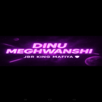

<!DOCTYPE html>
<html lang="hi">
<head>
    <meta charset="UTF-8">
    <meta name="viewport" content="width=device-width, initial-scale=1.0">
    <meta name="description" content="JBR KING DINU MEGHWANSHI की ऑफिशियल वेबसाइट - यूट्यूबर, मोटिवेशनल लेखक और RP GRAND लीडर">
    <meta name="keywords" content="JBR, Dinu Meghwanshi, JBR KING, RP GRAND, Motivational Writer, YouTuber, Bhilwara, Rajasthan">
    <meta name="author" content="Dinu Meghwanshi">
    <title>JBR KING DINU MEGHWANSHI</title>
    
</head>
<body>
    <header class="hero">
        
        <h1>𝓓𝓲𝓷𝓾 𝓜𝓮𝓰𝓱𝔀𝓪𝓷𝓼𝓱𝓲</h1>
        
JBR KING - जो बुझे नहीं, वो रौशनी बने!

    </header>

    <section class="section about">
        <h2>About Me</h2>
        
मेरा नाम Dinu Meghwanshi है। मैं Bhilwara, Rajasthan से हूँ। JBR सोच की रौशनी है। RP GRAND गेम में मेरी पहचान JBR KING के नाम से है। मैं एक यूट्यूबर, मोटिवेशनल लेखक और युवा लीडर हूँ।

    </section>

    <section class="section links">
        <h2>Connect with Me</h2>
        <a href="https://www.instagram.com/dinu_meghwanshiii?igsh=cGRvbHd0NmhjYncz" target="_blank">Instagram</a>
        <a href="https://youtube.com/@jbrking2.o" target="_blank">YouTube 1</a>
        <a href="https://youtube.com/@ramdevsaund1" target="_blank">YouTube 2</a>
    
        <a href="https://discord.gg/42PgVqMj"
        target="_blank">Discord 1</a>Index.html</footer><section class="section shayari" style="background: #fff0f5; border-left: 5px solid #b300ff; margin: 2rem auto; padding: 2rem; border-radius: 10px;">
    <h2 style="text-align:center; color:#b300ff;">✨ शायरी ✨</h2>
    

        "जिनके इरादों में हो आग,  
        उन्हें रोक नहीं सकती कोई बाधा।  
        मेहनत को जिसने बना लिया है इबादत,  
        उसका नाम बनता है हर दास्तां में वादा।"
    

    
- 𝓓𝓲𝓷𝓾 𝓜𝓮𝓰𝓱𝔀𝓪𝓷𝓼𝓱𝓲

</section>
        <a 
            <!-- SEO Tags for Google Search -->
<meta name="title" content="JBR KING DINU MEGHWANSHI">
<meta name="description" content="Founder of JBR, YouTuber, Motivational Writer & RP GRAND Leader from Bhilwara.">
<meta name="keywords" content="JBR, Dinu Meghwanshi, RP GRAND, YouTuber, Bhilwara, JBR KING">
<meta name="author" content="Dinu Meghwanshi">
<meta name="robots" content="index, follow">href="https://discord.gg/nRsbbp6X" target="_blank">Discord 2</a>
    </section>

    <footer>
        © 2025 𝓓𝓲𝓷𝓾 𝓜𝓮𝓰𝓱𝔀𝓪𝓷𝓼𝓱𝓲 | Powered by JBR
    </footer>
</body>
</html>

